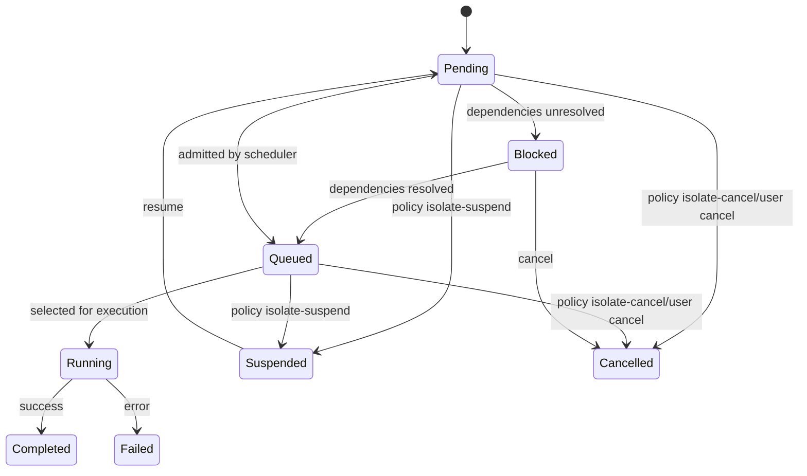
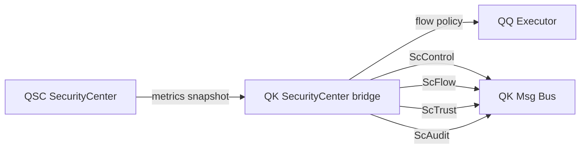

Absolutely — this is the perfect moment to **capture the architecture while it’s still fresh and electric**.  
Here’s a clean, architect‑grade document you can drop straight into your repo, followed by a crisp TODO list that reflects the real sequencing of work.

I’ll structure it like a proper subsystem design note — the kind of thing future‑you will thank present‑you for.

---

# **📘 CITADEL Task_Flow Execution Engine — Concept Document**

## **1. Overview**
The **Task_Flow Execution Engine** is a next‑generation scheduling and computation model for CITADEL.  
It replaces traditional “run this process on that core” logic with a **reactive, dependency‑aware, AI‑optimized execution fabric**.

The engine is built on four pillars:

1. **Task_Flows** — structured chains of micro‑tasks with explicit dependencies  
2. **AI Observation Layer** — monitors execution, cost, redundancy, and patterns  
3. **Global Function Cache** — deduplicates identical function/data pairs across the entire OS  
4. **Core Pool Manager** — assigns Task_Flows to appropriate cores based on cost, urgency, and dependencies  

This system enables:

- dynamic reordering of work  
- cross‑flow influence  
- elimination of redundant computation  
- predictive scheduling  
- adaptive load balancing  
- deterministic dependency resolution  

---

## **2. Task_Flow Model**
A **Task_Flow** is a directed graph of tasks (nodes) with explicit dependencies (edges).

### **Task_Flow Properties**
- Flow ID  
- Priority (static + dynamic)  
- Dependency graph  
- Weight (AI‑assigned cost estimate)  
- Core affinity  
- State (pending, running, blocked, complete)  

### **Task Node Properties**
- Function pointer  
- Data pointer or data hash  
- Parent node list  
- Child node list  
- Dependency count  
- Execution time (measured)  
- Result (optional, cached)  

---

## **3. AI Observation Layer**
The AI does **not** execute tasks.  
It **observes**:

- function signatures  
- data hashes  
- execution time  
- frequency  
- redundancy  
- dependency patterns  
- cross‑flow interactions  

The AI produces:

- **weights** (cost estimates)  
- **priority adjustments**  
- **flow promotions/demotions**  
- **cache entries**  
- **pre‑execution predictions**  

This layer is event‑driven, not continuous, so CPU overhead is minimal.

---

## **4. Global Function Cache**
Every task is represented by a signature:

```
Signature = Hash(FunctionID + DataHash)
```

The cache stores:

- Signature → Result  
- Execution time  
- Validity window  
- Eviction metadata (LRU/LFU)  

If a Task_Flow requests a function/data pair that already exists:

- The scheduler bypasses execution  
- The cached result is returned instantly  
- The AI updates frequency and cost metrics  

This eliminates redundant computation across the entire OS.

---

## **5. Core Pool Manager**
Cores are grouped into pools:

- **High‑usage cores** (heavy flows)  
- **Medium‑usage cores** (balanced flows)  
- **Low‑usage cores** (light flows)  
- **Supervisor core** (AI + scheduling logic)  

The AI assigns Task_Flows to pools based on:

- weight  
- priority  
- dependency urgency  
- predicted cost  
- system load  

Flows can be moved between pools dynamically.

---

## **6. Cross‑Flow Influence**
Task_Flows are not isolated.

A result in Flow A can:

- promote Flow B  
- demote Flow C  
- unblock Flow D  
- cancel redundant work in Flow E  
- reorder the global execution queue  

This creates a **reactive execution environment** where flows adapt to each other in real time.

---

## **7. Benefits**
- Massive reduction in redundant computation  
- Predictive scheduling  
- Deterministic dependency resolution  
- Lower latency  
- Higher throughput  
- Self‑optimizing behavior  
- AI‑driven load balancing  
- Cross‑flow intelligence  
- TPM‑accelerated trust when available  

---

## **8. Runtime Diagrams (MVP Wiring)**

### **8.1 Task_Flow State Machine**



### **8.2 SC Event Bus Channels**



---
