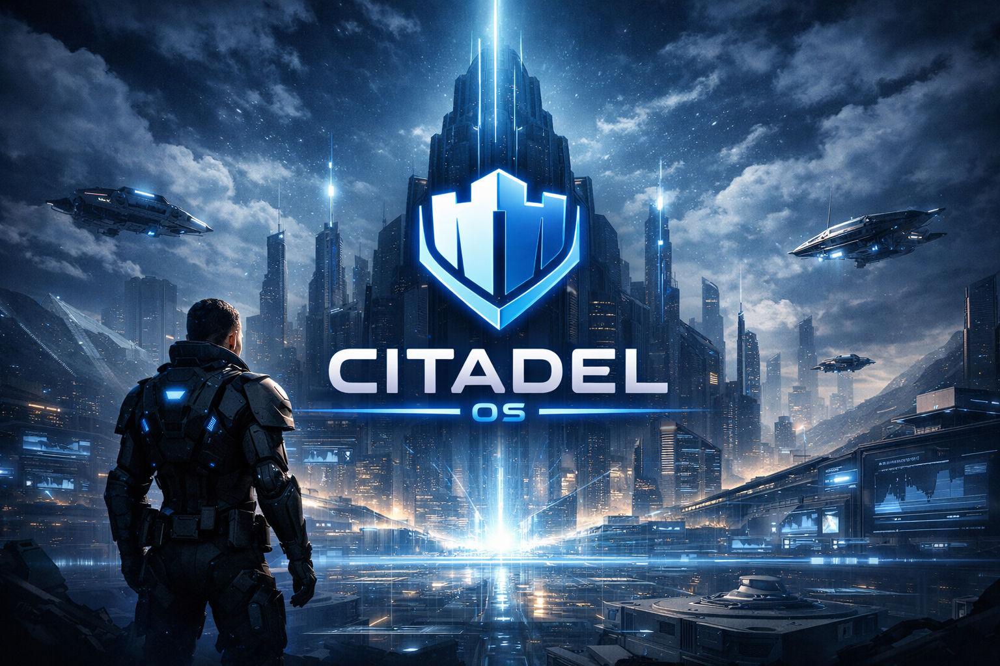
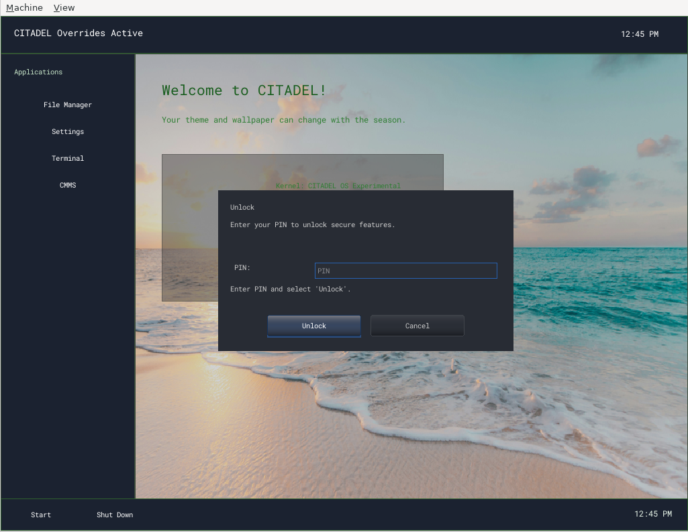
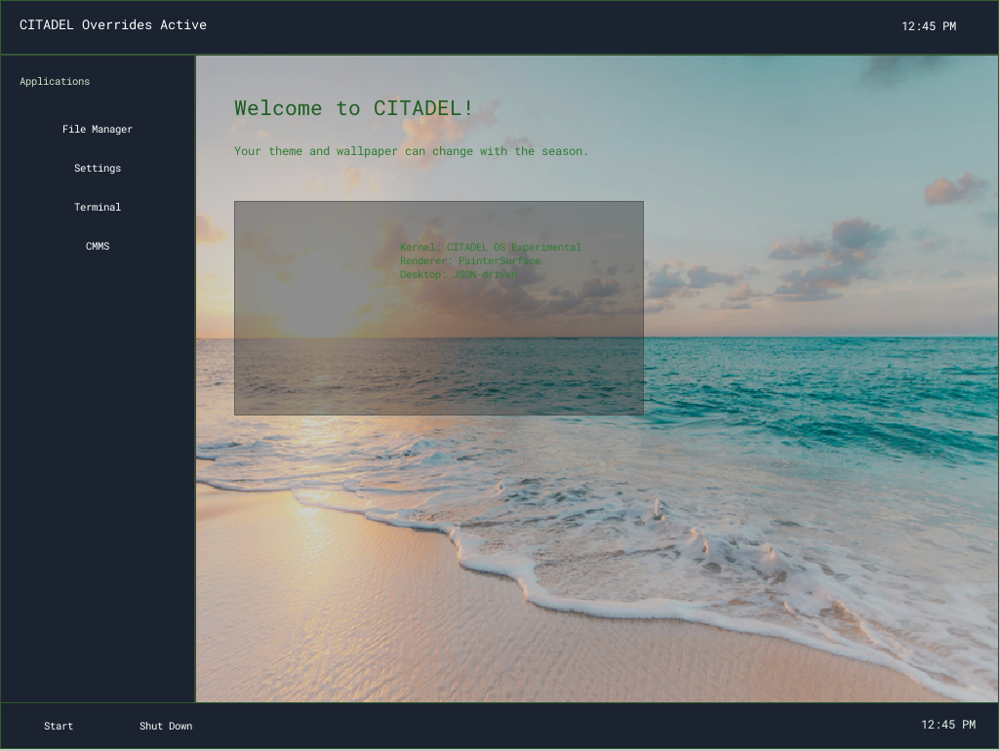
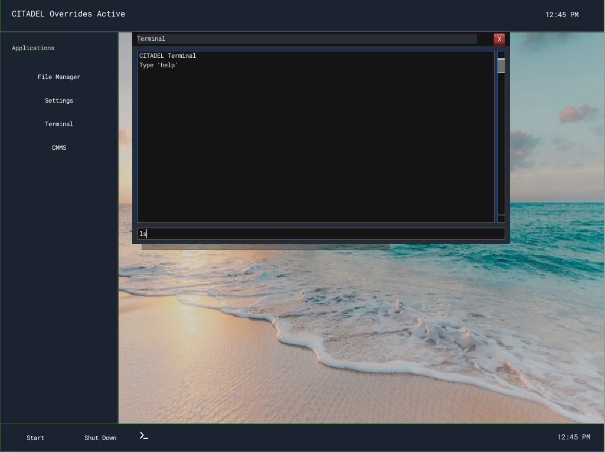
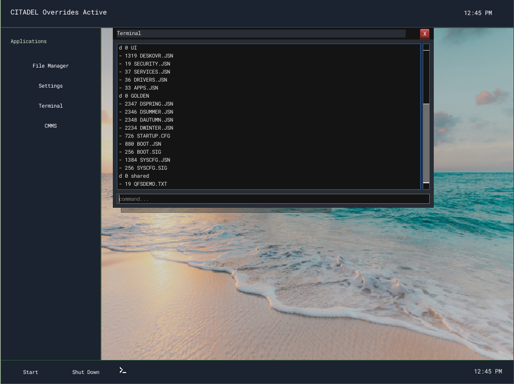
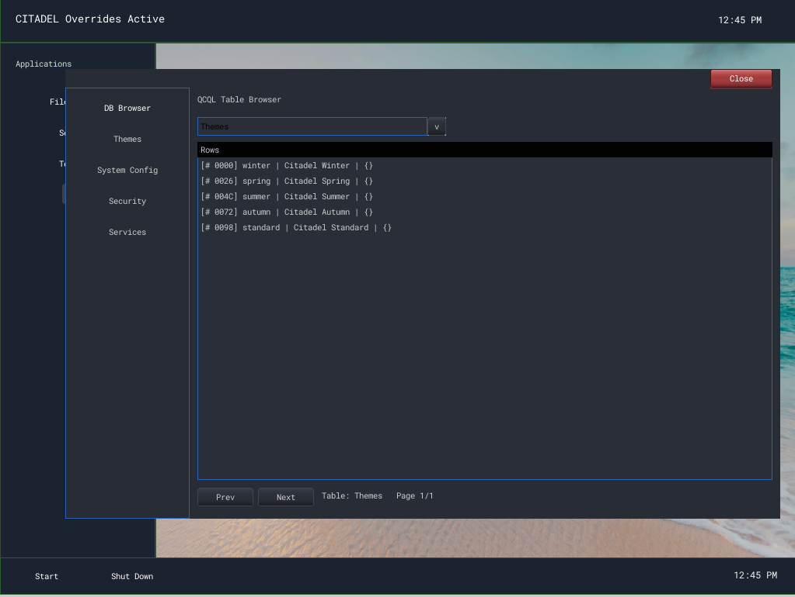
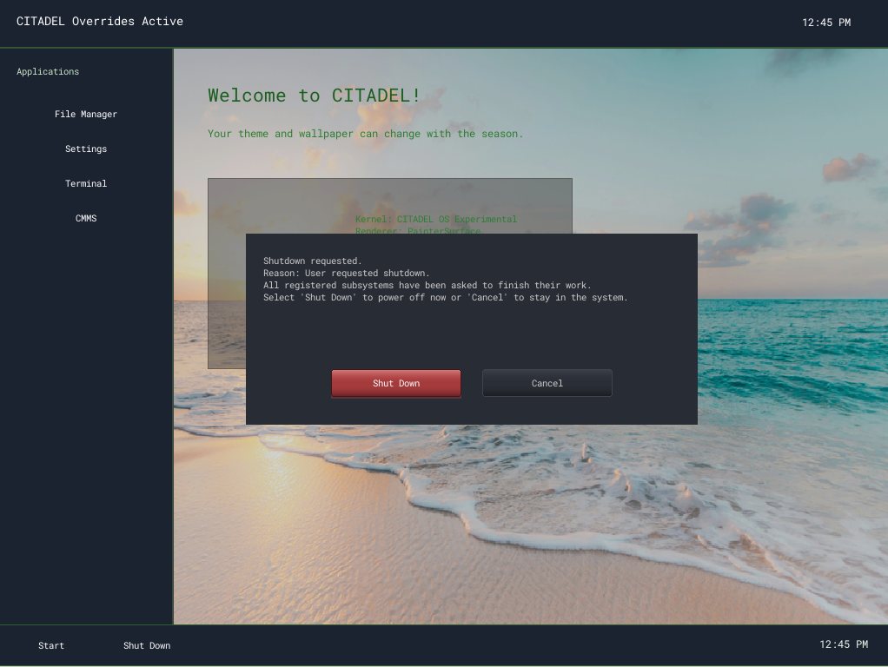

# CITADEL Kernel



A modular x86-64 kernel and desktop environment built with the Limine bootloader.

This README is the short entry point for the repository:
- build and run the system
- understand the top-level module layout
- see a brief snapshot of major working areas

For the full current implementation snapshot, use `CITADEL_CURRENT_STATE.md`.
For active planning, use `TODO_MAIN.md` and `TODO_INBOX.md`.

Current highlights:
- Desktop, windowing, and control stack are in active use.
- Bring-up grade IPv4 networking is working in the current QEMU workflow.
- QCQL now backs the active CMMS desktop runtime path: desktop documents and theme data are persisted in database tables, runtime rows are used at boot for the active layout, and generated CUI-ML preserves the existing parser/theme pipeline.
- Security Center, Task_Flow, and data-driven runtime work exist partly in code and partly as forward-looking design/spec material.

## Desktop runtime status

The desktop boot path is currently a hybrid that keeps the existing CUI-ML/control creation stack while sourcing layout data from CMMS/QCQL runtime rows.

- Authoritative desktop layouts still come from desktop documents such as `desktop.json` and the shipped CUI-ML scaffold.
- CMMS materializes normalized runtime rows for the active layout and the desktop now boots from those runtime rows instead of re-reading the legacy path directly.
- Runtime-generated CUI-ML includes the shared import, stylesheet, and theme scaffold so CUIMLSS parsing and theme fonts stay consistent with the legacy desktop path.
- Seasonal overrides from `desktop-overrides.json` still apply after runtime-row load.

## Networking bring-up (recent)

Citadel now has a practical “bring-up grade” IPv4 stack used for real Internet validation under QEMU SLIRP (10.0.2.x).

Milestones so far:
- DHCPv4 client at boot + runtime renewal (`ip dhcp`) to acquire IP/mask/gateway/DNS.
- ARP cache correctness + maintenance (aging/retry) and a terminal `arp` command for visibility.
- ICMP echo (ping) RX fixed; `ping` now waits/pumps and prints replies.
- DNS A-record resolver + `nslookup`; hostname support for commands that accept a destination.
- TCP connect + SYN retransmit/backoff + MSS option + basic RX buffering.
- HTTP diagnostics over TCP via `httpget` (headers tweaked for server compatibility; `Accept-Encoding: identity`).
- TCP event ring buffer + `tcplog` to see SYN/SYN-ACK/ACK/PSH/FIN flows.

Useful terminal commands:
- `ip` / `ip dhcp [timeout_ms]`
- `arp [ip]`
- `ping <ip|host> [timeout_ms]`
- `nslookup <name> [timeout_ms]`
- `tcpconnect <ip|host> <port> [timeout_ms]`
- `httpget <host> [path] [timeout_ms]`
- `tcplog`

## A Snapshot of our desktop design as it is at the moment.

The screenshot above reflects the current desktop shell with the latest console-first flow.

## Documentation map

- `CITADEL_CURRENT_STATE.md`: authoritative working-state snapshot
- `TODO_MAIN.md`: broader subsystem/product backlog
- `TODO_INBOX.md`: active stabilization queue
- `docs/CQL_REPO_BOUNDARY.md`: boundary between the external CQL project and Citadel's service/runtime integration
- `docs/`: subsystem specs, plans, and reference documents

## Screenshots













## Project Structure

```
citadel/
├── kernel/                  # Boot path, console, and kernel entry/runtime glue
├── QKernel/                 # Kernel services and shared command surfaces
├── QArch/                   # x86-64 architecture support (GDT/IDT/PCI/ports)
├── QKMemory/                # PMM/VMM/heap and memory translation
├── QEvent/                  # Event manager, queue, and listeners
├── QDrivers/                # Core device drivers and display bootstrap
├── XHCI/                    # USB xHCI subsystem
├── QFileSystem/             # VFS, FAT, volume management, mount paths
├── QNetwork/                # IPv4/ARP/ICMP/UDP/DHCP/DNS/TCP stack
├── QDesktop/                # Desktop shell and desktop orchestration
├── QWindowing/              # Windows, compositor, framebuffer integration
├── QWControls/              # UI controls library
├── QGraphics/               # Graphics abstraction layer
├── QCQL/                    # Citadel query/data runtime components
├── QCCore/                  # Core common utilities
├── QCMath/                  # Math primitives/utilities
├── QCSerialization/         # Serialization helpers
├── QUICommon/               # Shared UI/runtime common utilities
├── QCommand/                # Command infrastructure helpers
├── docs/                    # Design docs, runbooks, and reference material
├── tools/                   # Build, verification, and diagnostic scripts
└── build.sh / run.sh        # Primary build and run entrypoints
```

## Naming Conventions

### Modules
- `QC*` - **Q**AIOS **C**ommon (shared utilities)
- `QK*` - **Q**AIOS **K**ernel (kernel services)
- `QArch*` - **Q**AIOS **Arch**itecture (x86-64 specific)
- `QDrv*` - **Q**AIOS **Drv**ivers (hardware drivers)
- `QKDrv*` - **Q**AIOS **K**ernel **Drv**ivers (kernel-level input drivers)
- `QW*` - **Q**AIOS **W**indowing
- `QWControls/*` - **Q**AIOS **W**indowing control library (hierarchical folders)
- `QFS*` - **Q**AIOS **F**ile **S**ystem

### Files
- Headers: `Q<Module><Class>.h`
- Implementation: `Q<Module><Class>.cpp`
- Example: `QKDrvPS2Mouse.h`, `QKDrvPS2Mouse.cpp`

### Directories
- Use `PascalCase` for directory names.
- Use `ALLCAPS` for common initialisms/acronyms (e.g., `ACPI`, `TPM`).

See `Standards.md` for the full naming standard (this README is a quick reference).

### Namespaces
```cpp
namespace QC { }       // Common
namespace QK { }       // Kernel
namespace QArch { }    // Architecture
namespace QDrv { }     // Drivers
namespace QKDrv { }    // Kernel drivers
namespace QW { }       // Windowing
```

## Driver Architecture

### Input Driver Hierarchy
```
QKDrv::DriverBase           # Base interface
├── QKDrv::MouseDriver      # Mouse interface (relative/absolute)
└── QKDrv::KeyboardDriver   # Keyboard interface

QKDrv::PS2::Mouse           # PS/2 mouse implementation
QKDrv::PS2::Keyboard        # PS/2 keyboard implementation
QKDrv::UHCI::Controller     # USB 1.1 controller
QKDrv::XHCI::XHCIController # USB 3.0 controller
```

### Driver Manager
The `QKDrv::Manager` probes for available controllers and selects the best driver:
1. **USB** (xHCI, then UHCI) - preferred for tablet/absolute positioning
2. **PS/2** - fallback for keyboard/mouse

## Building

First-time setup (required):

```bash
git submodule update --init --recursive
```

```bash
# Configure
cmake -B build -S .

# Build
cmake --build build

# Output: build/kernel/citadel.elf, build/citadel.bin
```

The full packaging flow via `./build.sh` emits separated artifacts before ISO staging:

```text
build/artifacts/kernel/citadel.elf
build/artifacts/kernel/citadel.bin
build/artifacts/modules/ramdisk.img
```

### Build Tasks (VS Code)
- **Build Kernel**: `cmake --build build`
- **Configure CMake**: `cmake -B build -S .`
- **Clean**: `rm -rf build`

## Running (QEMU)

```bash
# Basic run
qemu-system-x86_64 -kernel build/citadel.elf -serial stdio

# With USB mouse (recommended, matches real hardware)
qemu-system-x86_64 -kernel build/citadel.elf -serial stdio -usb -device usb-mouse

# Optional: USB tablet (absolute positioning)
qemu-system-x86_64 -kernel build/citadel.elf -serial stdio -usb -device usb-tablet

# Create ISO with Limine
./build.sh
qemu-system-x86_64 -cdrom build/citadel-limine.iso -serial stdio

# If your host window manager "eats" the first click just to focus the QEMU window,
# and your QEMU build supports it, use grab-on-hover so the first click reaches the guest UI.
# (Not all QEMU display backends/builds expose this suboption.)
qemu-system-x86_64 -cdrom build/citadel-limine.iso -serial stdio -display gtk,grab-on-hover=on
```

### Shared host folder (QEMU)

- Create a directory named `shared/` at the repo root. The build script detects it automatically.
- `./build.sh -r` now passes `-drive file=fat:rw:shared,...` to QEMU, exposing the folder as an IDE FAT volume so host↔guest file drops stay in sync.
- Enable the guest-side auto-mount by setting `IDE_SHARED=1` in `startup.cfg` (this controls the legacy IDE probe at boot).
- If detected, the kernel registers it as `QFS_SHARED` and mounts it at `/shared`.

### Persistent system volume (QEMU)

- Use `./build.sh -r --system-vol` to attach the persistent FAT32 system disk image at `build/system.qcow2`.
- In that mode the guest mounts `/system` from the virtual disk instead of relying only on the ramdisk copy, so desktop/runtime data written under `/system` persists across boots.
- A common development run is `./build.sh -r --tpm --system-vol --relmouse --prod`.

## Bootable USB (real hardware)

Citadel builds a Limine ISO at `build/citadel-limine.iso`. The easiest way to make a bootable USB stick is to write the ISO to the raw device.

There is also a helper script that builds the ISO, lists likely USB targets, forces an explicit disk choice, and then writes the image:

```bash
tools/write_bootable_usb.sh --list
tools/write_bootable_usb.sh --device /dev/sdX
```

If you are on WSL and only see the USB stick as a mounted Windows drive such as `/mnt/F`, that is not the raw device. You need to attach the physical disk into WSL first, then write to the `/dev/sdX` node that appears:

```powershell
# Elevated Windows PowerShell example for drive F:
Set-Disk -Number 2 -IsOffline $true
wsl.exe --mount \\.\PHYSICALDRIVE2 --bare
```

```bash
# Back in WSL
lsblk
tools/write_bootable_usb.sh --device /dev/sdX --skip-build
```

```powershell
# When finished
wsl.exe --unmount \\.\PHYSICALDRIVE2
Set-Disk -Number 2 -IsOffline $false
```

On removable USB sticks where `Set-Disk -IsOffline` is not supported, the helper script can instead delegate the raw write to Windows directly from WSL:

```bash
tools/write_bootable_usb.sh --device /mnt/F --skip-build
```

That path resolves `F:` to its backing `PhysicalDriveN`, dismounts the Windows volume with `mountvol`, and streams the ISO through a Windows raw disk handle. Run the shell from an elevated Windows-hosted terminal if Windows prompts for administrator rights.

```bash
./build.sh

# Find your USB device (example: /dev/sdX). Double-check this.
lsblk

# This will erase the target drive.
sudo dd if=build/citadel-limine.iso of=/dev/sdX bs=4M status=progress oflag=sync
```

Notes:
- Disable UEFI Secure Boot for now (Limine isn’t signed for Microsoft Secure Boot).
- Whether it boots depends on your firmware mode (UEFI vs legacy BIOS/CSM) and hardware support in the kernel. Expect "boots on some machines" at this stage.

## Desktop JSON & Theming

The desktop shell loads [desktop.json](desktop.json) from the ramdisk (build.sh copies it to `/DESKTOP.JSN`). Everything under `desktop.theme` controls runtime styling.

Optional production/runtime tweaks can be provided via `desktop-overrides.json` (packed as `/DESKOVR.JSN` / `/PROD/DESKOVR.JSN`).

- `season`: `spring|summer|autumn|fall|winter` applies the matching seasonal preset theme/background.
- `season`: `auto` reads the CMOS RTC (month/day) and derives the season automatically.

### Theme loader

`theme` accepts either a string (path to a `.json` theme) or an object:

```json
"theme": {
	"base": "Vista",
	"file": "/system/themes/vista.json",
	"definition": { "colors": { /* inline Theme */ } },
	"overrides": { /* see below */ }
}
```

- `base`: builtin preset name understood by `QDTheme` (e.g., `Vista`, `DarkGlass`).
- `file` / `path`: filesystem location of a full theme definition; first one that loads wins.
- `definition`: inline `QDTheme` payload; alternatively, placing `colors`/`effects`/`animations` (or `base`) at the root of the `theme` object is also treated as a full definition.
- `overrides`: optional partial tweaks merged on top of the loaded theme.

Colors everywhere follow `#RRGGBB` or `#AARRGGBB`.

### Overrides schema

#### `palette`

| Key             | Description                                                            |
| --------------- | ---------------------------------------------------------------------- |
| `accent`        | Primary highlight color used for selection rings and accent buttons.   |
| `accentLight`   | Lighter hover state for accent/selection affordances.                  |
| `accentDark`    | Pressed/active accent fill and window title background.                |
| `text`          | Default control text color.                                            |
| `textSecondary` | Secondary text (sidebar, supporting labels).                           |
| `panel`         | Base panel fill (top bar, sidebar, taskbar, window body).              |
| `panelBorder`   | Panel/window border color; also seeds button borders if unset.         |

#### `metrics`

| Key                   | Type  | Description                                               |
| --------------------- | ----- | --------------------------------------------------------- |
| `cornerRadius`        | u32   | Window corner radius; doubles as button radius if specific button radius is not supplied. |
| `buttonCornerRadius`  | u32   | Button corner radius only.                                |
| `borderWidth`         | u32   | Outline width applied to windows and buttons.             |

#### `button`

Currently recognized roles are `sidebar`, `accent`, and `destructive`, which map to the same `QW::ButtonRole` entries used in code. Each role block supports:

| Field            | Type    | Description                                               |
| ---------------- | ------- | --------------------------------------------------------- |
| `fillNormal`     | color   | Idle fill.                                                |
| `fillHover`      | color   | Hover fill.                                               |
| `fillPressed`    | color   | Pressed fill.                                             |
| `text`           | color   | Foreground text/icon color.                               |
| `border`         | color   | Outline color.                                            |
| `glass`          | bool    | Enables glass highlight treatment for that role.          |
| `shineIntensity` | float   | 0.0–1.0 intensity controlling simulated specular highlights/overlays. |

#### `font`

| Key       | Type   | Description                                                                 |
| --------- | ------ | --------------------------------------------------------------------------- |
| `size`    | u32    | Base UI font size. `12` maps to 1.0× scaling; values are clamped to 1–255.  |
| `family`  | string | Optional hint recorded for future font switching (current renderer is fixed). |

#### `effects`

- **`border`**: `color`, `width`, `radius`. Updates both palette borders and metrics.
- **`shadow`**: `offsetX`, `offsetY` (signed), `blur` (u32), and `color`. Drives control/window drop shadows.
- **`glow`**: `radius`, `intensity` (0–255, converted to alpha), `color`. Applied to accent/destructive/sidebar-selected/taskbar-active roles.
- **`transparency`**: `windowOpacity` and `panelOpacity` (0–255). Governs background alpha for windows vs. chrome panels.

Any override flag activates `m_themeOverrides`, so a minimal palette tweak is enough to opt-in. Combine this with the layout controls in [desktop.json](desktop.json) to ship seasonal or branded desktops without rebuilding the kernel.

## Recent Changes (Feb 19, 2026)

## Recent Changes (Jun 17, 2026)

See `TODO_INBOX.md` Batch 21 to 30 and `CITADEL_CURRENT_STATE.md` section 12 for implementation and evidence pointers.

- Hardened pre-desktop session gating with clearer fail-closed behavior in ambiguous owner-gate restart conditions.
- Expanded SecureStore TPM parity behavior so TPM-provisioned systems refuse non-TPM fallback when the TPM anchor path is unavailable.
- Extended shutdown robustness and observability with explicit ACPI grace-timeout/unavailable fallback diagnostics and structured boot events.
- Added runtime keyboard/mouse tuning controls (`keyrepeat`, `mousespeed`, `mousecfg`) with startup config persistence for bring-up tuning.
- Expanded command-layer visibility (`showmode`, `bevdump`) so fallback paths, anchor state, and active tuning values are easier to inspect and verify.

## Recent Changes (Feb 19, 2026)

See [backups/2026-02-19_backup_summary.md](backups/2026-02-19_backup_summary.md) for the detailed log.

- Restructured QC libraries into `QCCore/`, `QCMath/`, `QCSerialization/`, `QUICommon/`, `QCommand/` with `QCommon` kept as a compatibility umbrella target.
- Added a permanent `cpu_relax()` (x86 `pause`) routine in NASM and replaced deprecated `volatile` delay loops in UHCI/XHCI.
- Added `startup.cfg` support (packed into ramdisk) and optional QEMU host share plumbing.
- Continued desktop/theme work: transparency + font scaling overrides, painter text scaling, and a minimal terminal `ls` command.

## Recent Changes (Feb 9, 2026)

### Driver Refactoring
- Created unified driver structure under `kernel/Drivers/`
- Implemented `QKDrv::Manager` for driver probing and selection
- Separated drivers by controller type: PS2, UHCI, XHCI
- Removed old `QUSB/` module (replaced by kernel/Drivers/UHCI, XHCI)
- Removed old `drivers/usb/` C code
- Cleaned up `QDrivers/` to only keep Timer and BGA

### Input System
- PS/2 mouse/keyboard now use new `QKDrv::PS2::*` classes
- Mouse callback uses `QKDrv::MouseReport` (supports both relative and absolute)
- Keyboard uses `QKDrv::PS2::KeyEvent` with full modifier support
- Mouse cursor starts at screen center (not corner)

### Boot Fixes (earlier session)
- Fixed IDT selector (0x28 for Limine's 64-bit CS)
- Fixed IRQ stubs (dummy error code for consistency)
- Enabled IRQ2 cascade for slave PIC (mouse IRQ12)
- Fixed mouse axis inversion for VM compatibility

## Key Components

### Memory
- **Early heap**: 32MB static buffer before PMM
- **Early DMA**: 1MB identity-mapped buffer for USB
- **PMM**: Page frame allocator (4KB pages)
- **VMM**: Virtual memory with paging

### Events
- Event queue with type-based filtering
- Listener registration with category masks
- Mouse/keyboard events routed through `QK::Event::EventManager`

### Windowing
- Compositor with software cursor (12x16 arrow)
- Window manager with focus tracking
- Desktop window with shutdown button (Ctrl+Q or button click)

## License

MIT License

## Author

QAIOS Project
