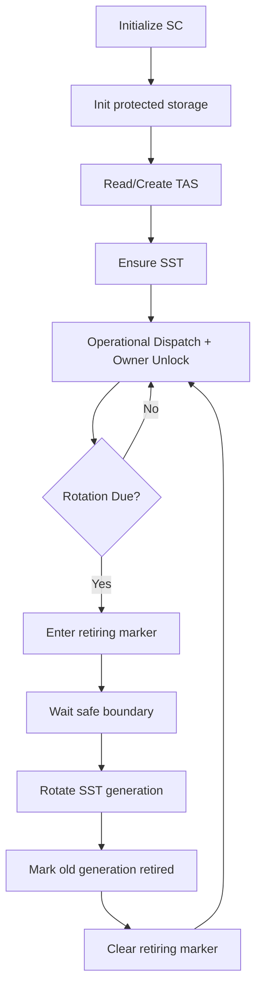

# Provisioning + TAS/SST Lifecycle

## Lifecycle Stages

1. Boot init
- Security Center initializes runtime mode and providers.
- Protected storage layout under `/system/.sc` is initialized.

2. TAS availability
- TAS is read from SecureStore (`readTas`) or created (`getOrCreateTas`) when provisioning.

3. SST ensure/provision
- SST is ensured via QSC integration.
- First successful generation emits provisioning-complete audit signal.

4. Runtime operations
- Owner unlock derives UMK/VRK session keys.
- Dispatch policy gates exec/vault/audit requests.
- Audit decisions append to tamper-evident chain.

5. Rotation scheduling
- Rotation is triggered by time/task thresholds and policy checks.
- Rotation starts in `retiring` mode while in-flight work drains.

6. Cutover + retirement
- On successful rotation, generation pointers advance.
- Retiring marker is cleared and old-generation retirement marker is written.

## Minimal State Markers

- `SST.RET`: set while SST is in retiring/cutover window.
- `SSTOLD.DEL`: set after old SST generation retirement step completes.

## Diagram

